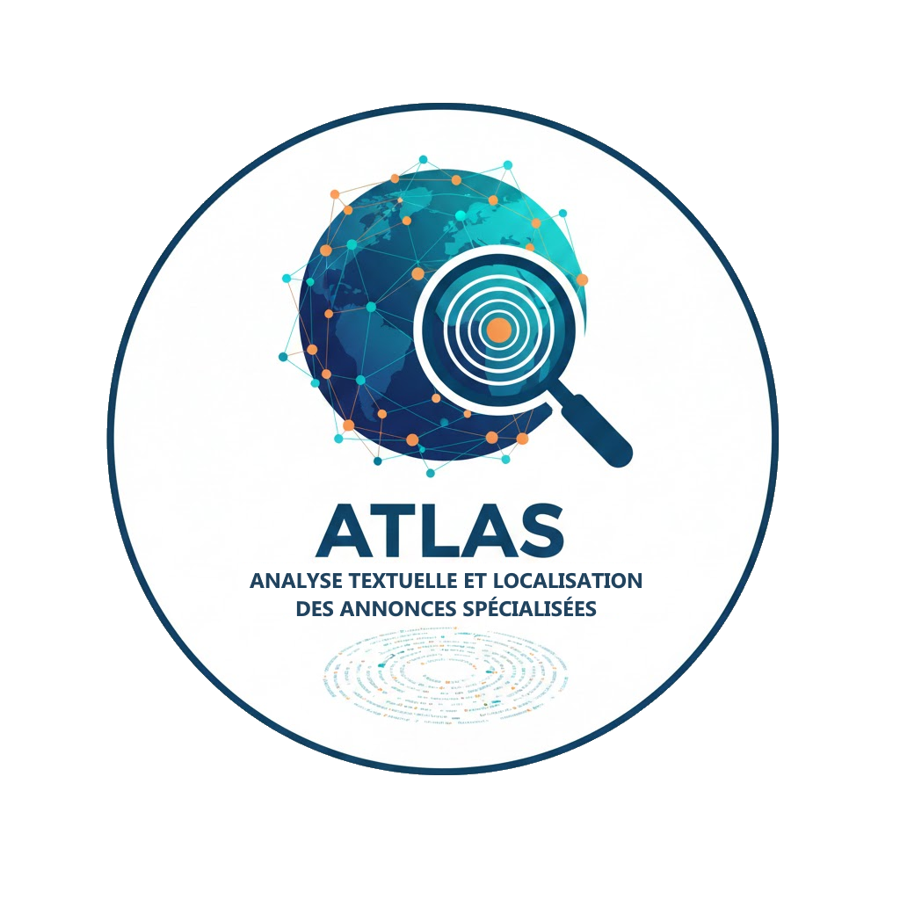

# Projet ATLAS

### A.T.L.A.S. — Analyse Textuelle et Localisation des Annonces Spécialisées

<p align="center">
  
</p>

ATLAS est un projet de Text Mining / NLP appliqué aux offres d’emploi, avec une dimension géographique, une couche de web scraping, une base de données modélisée en entrepôt, et une application interactive pour explorer et visualiser les analyses.

# Objectifs du projet

Le projet vise à :

- Collecter automatiquement des offres d’emploi (web scraping / API).
- Construire un corpus annoté et structuré, centré sur un domaine (IA, data, ML…).
- Modéliser une base de données entrepôt (table de faits + dimensions).
- Développer une application interactive (Dash, Bokeh, Streamlit…) permettant :

  - L’exploration du corpus
  - La recherche d’annonces
  - L’analyse de texte (NLP)
  - La visualisation cartographique
  - La possibilité d’ajouter dynamiquement de nouvelles offres

- Déployer l’ensemble avec Docker

## 📹 Vidéo de démonstration

> 🎥 **Installation et utilisation** : [Lien vers la vidéo](#)  
> _(Remplacez le # par l'URL de votre vidéo)_

## 🚀 Installation et lancement

### Option 1 : Lancement avec Docker (recommandé)

La méthode la plus simple pour démarrer l'ensemble du projet :

```bash
# Cloner le projet
git clone <url-du-repo>
cd Projet-ATLAS

# Lancer tous les services (API + Streamlit + Base de données)
docker-compose up --build -d

# Vérifier que les containers sont démarrés
docker-compose ps

# Accéder à l'application
# - Streamlit : http://localhost:8501
# - API FastAPI : http://localhost:8000
# - Documentation API : http://localhost:8000/docs
```

Pour arrêter les services :

```bash
docker-compose down
```

### Option 2 : Lancement en local (développement)

Pour exécuter l'application en mode développement sans Docker :

#### Prérequis

- Python 3.11+
- PostgreSQL (ou accès à Supabase)
- Modèles NLP pré-entraînés

#### Installation

```bash
# 1. Créer un environnement virtuel
python -m venv venv
source venv/bin/activate  # Linux/Mac
# ou
.\venv\Scripts\activate  # Windows

# 2. Installer les dépendances API
cd api
pip install -r requirements.txt
python -m spacy download fr_core_news_md

# 3. Installer les dépendances Streamlit
cd ../streamlit_app
pip install -r requirements.txt

# 4. Installer les dépendances collectors (optionnel)
cd ../collectors
pip install -r requirements.txt
```

#### Lancement de l'API

```bash
# Depuis le dossier racine du projet
cd api
uvicorn main:app --reload --host 0.0.0.0 --port 8000
```

L'API sera accessible sur : http://localhost:8000

#### Lancement de Streamlit

```bash
# Dans un autre terminal, depuis le dossier racine
cd streamlit_app
streamlit run app.py
```

L'interface Streamlit sera accessible sur : http://localhost:8501

#### Configuration

Assurez-vous de configurer les variables d'environnement nécessaires :

- `DATABASE_URL` : URL de connexion PostgreSQL
- `API_URL` : URL de l'API (par défaut : http://localhost:8000)
- `RAPIDAPI_KEY`: Clé API pour Glassdoor

### 📊 Génération des modèles NLP (optionnel)

Si vous souhaitez régénérer les modèles de topic modeling :

```bash
cd NLP/scripts
python topic_modeling_full.py
```
