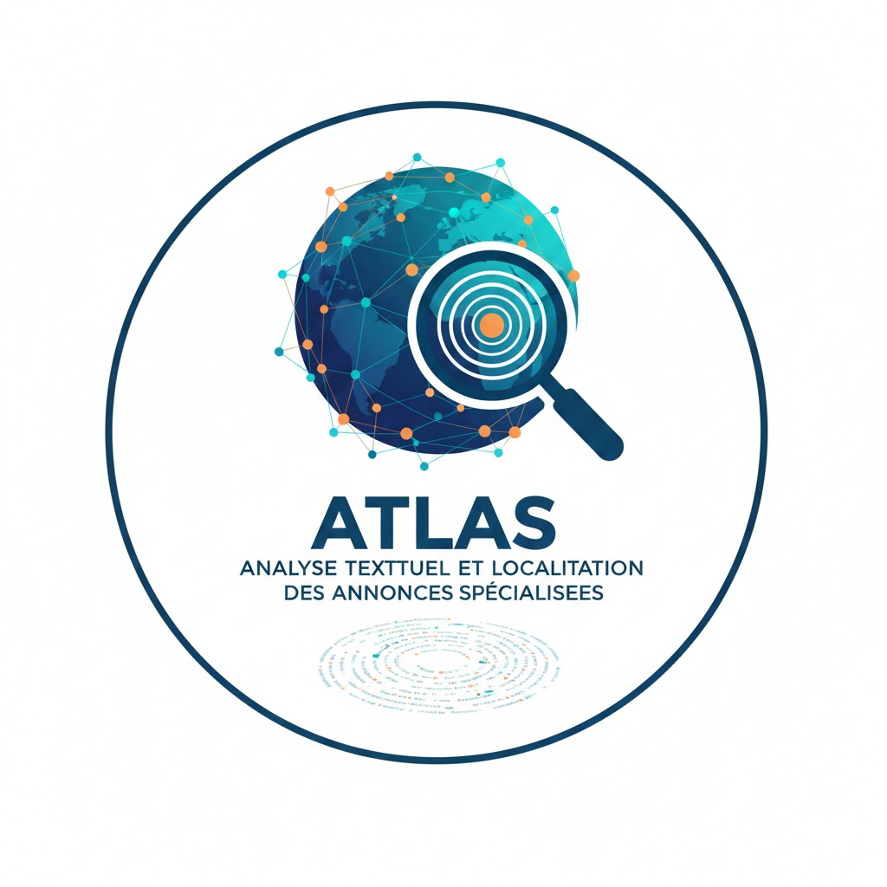

# Projet ATLAS
### A.T.L.A.S. — Analyse Textuelle et Localisation des Annonces Spécialisées

<table style="border: none;">
  <tr style="border: none;">
    <td width="200" align="center" style="border: none;">
      
    </td>
    <td style="border: none;">
      ATLAS est un projet de Text Mining / NLP appliqué aux offres d’emploi, 
      avec une dimension géographique, une couche de web scraping, une base de 
      données modélisée en entrepôt, et une application interactive pour explorer 
      et visualiser les analyses.
    </td>
  </tr>
</table>

# Objectifs du projet

Le projet vise à :
- Collecter automatiquement des offres d’emploi (web scraping / API).
- Construire un corpus annoté et structuré, centré sur un domaine (IA, data, ML…).
- Modéliser une base de données entrepôt (table de faits + dimensions).
- Développer une application interactive (Dash, Bokeh, Streamlit…) permettant :

    - L’exploration du corpus
    - La recherche d’annonces
    - L’analyse de texte (NLP)
    - La visualisation cartographique
    - La possibilité d’ajouter dynamiquement de nouvelles offres

- Déployer l’ensemble avec Docker